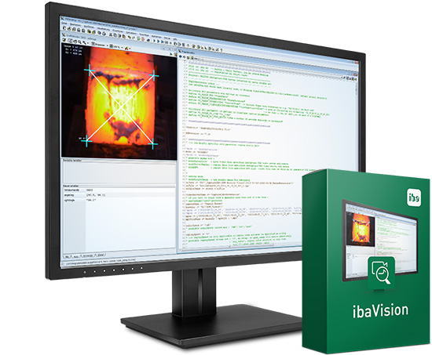

# ibaVision Example Scripts

The default plug-ins delivered with ibaVision (HALCON and Python) require 
finished scripts to set up a running ibaVision program.

This repository contains examples for both HALCON and Python. They are 
intended to set up simple ibaVision configurations that can be tested in 
combination with ibaPDA and ibaCapture.

## Requirements
- [ibaVision](https://www.iba-ag.com/en/ibavision) (v3.0.0 or newer to use with Python)
- [ibaPDA](https://www.iba-ag.com/en/ibapda) (v8.0.0 or newer for use with ibaVision v3)
- [ibaCapture](https://www.iba-ag.com/en/ibacapture) (v5.1.6 or newer for use with ibaVision v3)
- Appropriate licenses for the used iba-products

### HALCON
- HALCON (v20.11/v18.11/v13/v12)
  - Old HALCON versions may not support all ibaVision features
  - Future versions of ibaVision will drop support for old versions of HALCON
- Appropriate license

### Python
- Python v3.8.x
- Numpy v1.16 (or newer)

## Disclaimer

The code in this repository is provided “as is” and can be used to set up 
simple configurations and to demonstrate the communication between 
ibaVision and ibaPDA/ibaCapture. iba AG does not provide general support 
for programming languages, third party libraries/products or for user 
created functionalities. All terms of ibaVision's license agreement apply.

HALCON is a registered trademark of [MVTec Software GmbH](https://www.mvtec.com).

## Where can I find more information?

The ibaVision manual contains detailed explanation on how to use and 
configure ibaVision programs. 
After logging in to the iba AG website, the ibaVision manual can be 
found in the [Download area](https://www.iba-ag.com/en/downloads).
